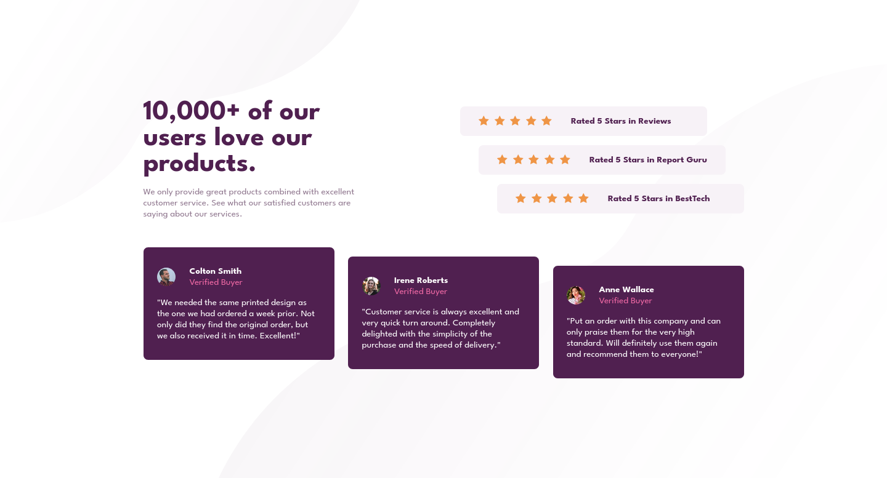
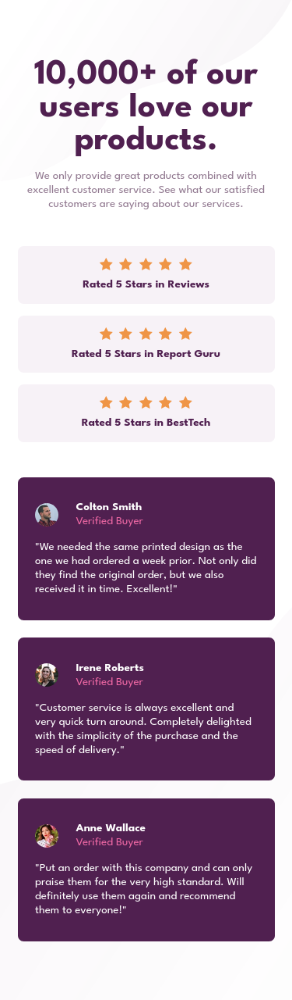

# Frontend Mentor - Social proof section solution

This is a solution to the [Social proof section challenge on Frontend Mentor](https://www.frontendmentor.io/challenges/social-proof-section-6e0qTv_bA). Frontend Mentor challenges help you improve your coding skills by building realistic projects. 

## Table of contents

- [Frontend Mentor - Social proof section solution](#frontend-mentor---social-proof-section-solution)
  - [Table of contents](#table-of-contents)
  - [Overview](#overview)
    - [The challenge](#the-challenge)
    - [Screenshot](#screenshot)
      - [Desktop (1440px)](#desktop-1440px)
      - [Mobile (375px)](#mobile-375px)
      - [Original design](#original-design)
    - [Links](#links)
  - [My process](#my-process)
    - [Built with](#built-with)
    - [What I learned](#what-i-learned)
  - [Author](#author)

## Overview

### The challenge

Users should be able to:

- View the optimal layout for the section depending on their device's screen size

### Screenshot
Here is the component at various sizes.
#### Desktop (1440px)

#### Mobile (375px)

#### Original design

### Links

- Solution URL: [Frontend Menthor solution](https://your-solution-url.com)
- Live Site URL: [live site](https://your-live-site-url.com)

## My process

### Built with

- Semantic HTML5 markup
- CSS custom properties
- Flexbox
- CSS Grid
- Cube CSS
- Mobile-first workflow

### What I learned

To better handle Cube CSS methodologies in various cases and some intresting use cases of custom properties.

## Author

- Website - [Simone Boccuzzi](https://github.com/PadronToni)
- Frontend Mentor - [@PadronToni](https://www.frontendmentor.io/profile/PadronToni)

